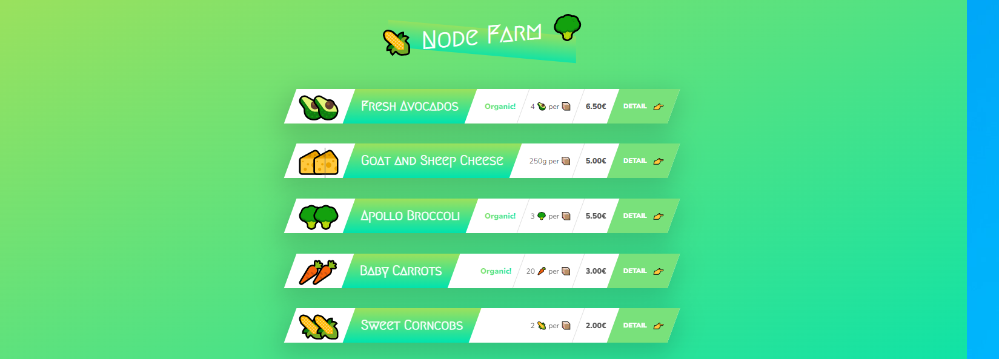

# Getting Started with Expence Tracker

Node Farm is an Node.js app where you can add new product and can open details page for each product
## Install app
/Execute from project root directory/

Install project dependencies:
```
npm install
```
## Start app
Start the app:
```
node index.js
```
Open in browser:
```
http://localhost:8000/
---
Tecnologies:
* Use Node.js
* Use Core modules: File system, URL,HTTP

Dependencies:
* Use Slugify


